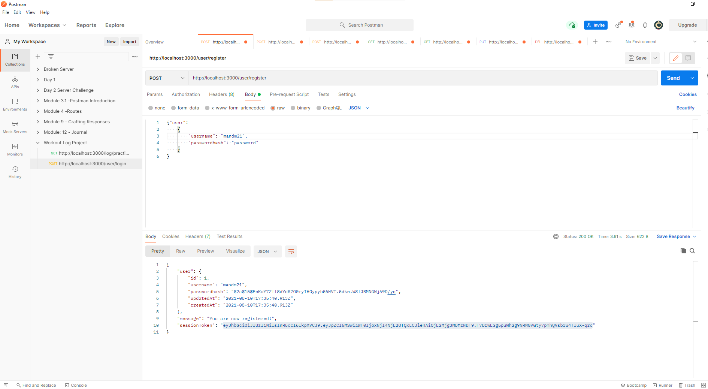
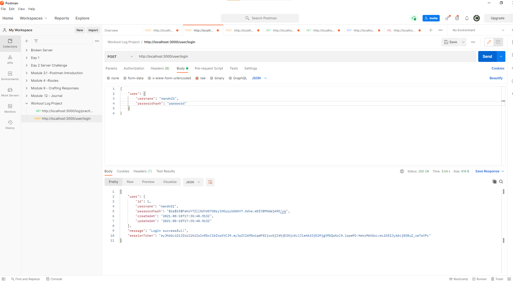
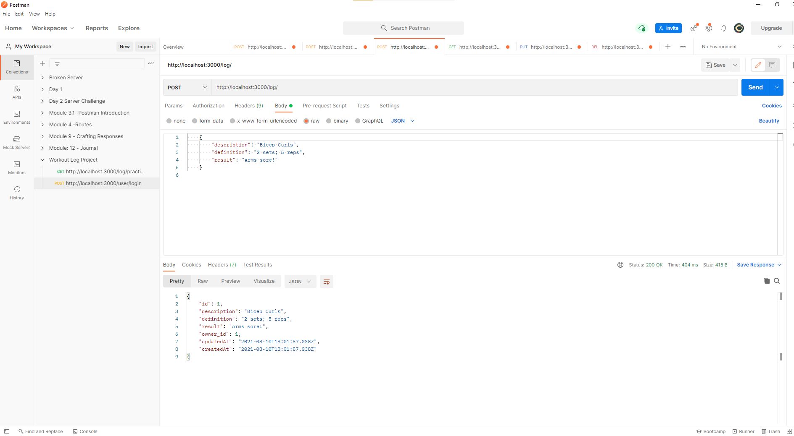
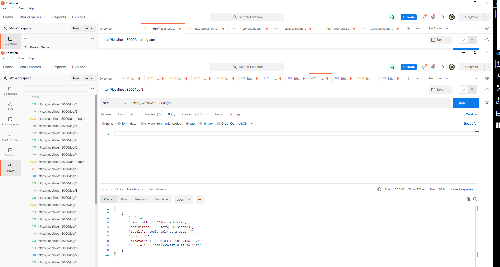
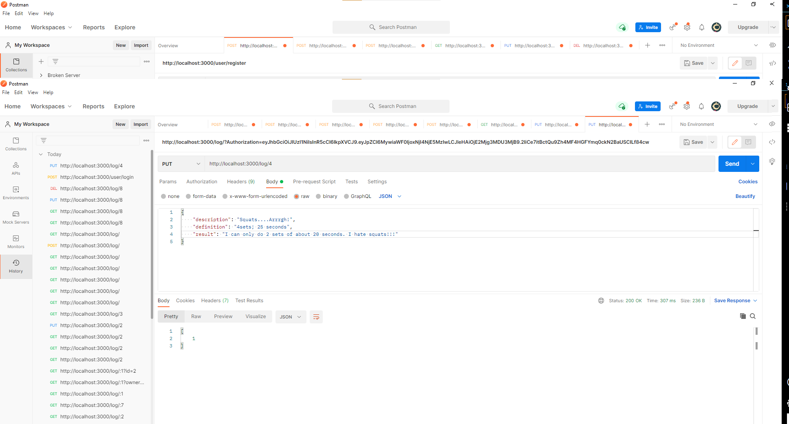
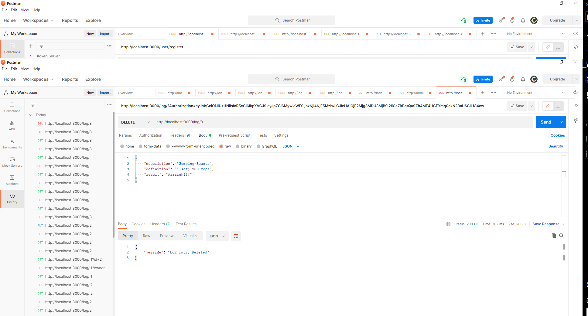

# Workout Server

If you are getting started on this project We would recommend the following

## Create your folders

- Middleware
- Controllers
- Models

## Create files

- app.js
- db.js
- .env
- .gitignore

## Build As needed

- user controller
- log controller
- validate session

## Screenshots for Workout Log Project

-#1 User Register Successful Screenshot

-#2 User Login Successful Screenshot

-#3 User Create Post Screenshot

-#4 Get Logs By Log Id

-#5 Get All Logs By User

-#6 Update Log Post

-#7 Delete Log Post

